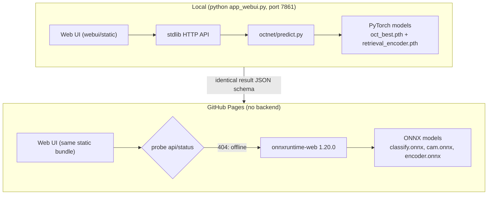
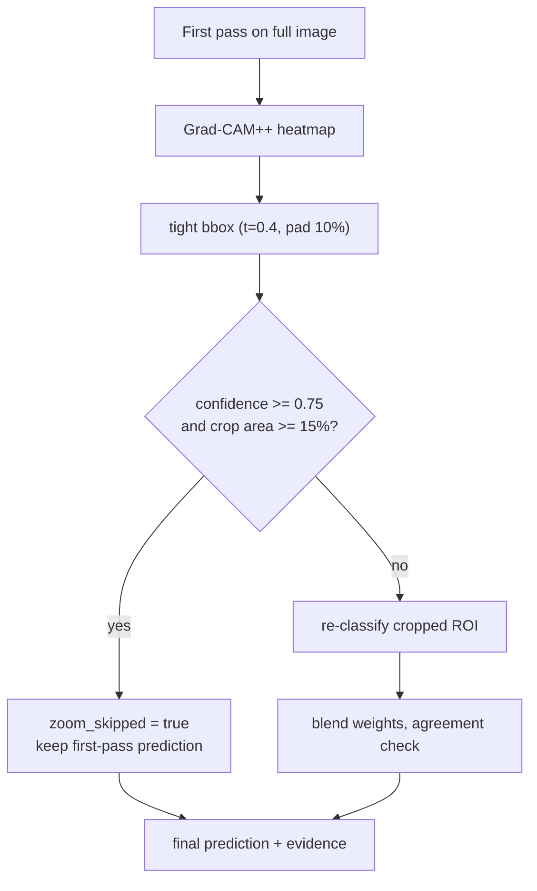
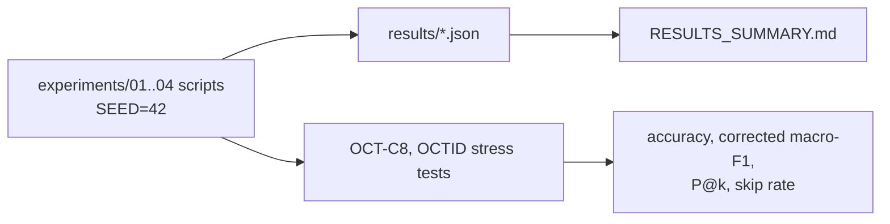

# OCT Agentic Diagnostic Pipeline - Diagrams

Mermaid diagrams render on GitHub. They describe the implemented system only.

## 1. Inference pipeline

```mermaid
flowchart LR
    A["OCT B-scan input<br/>(PNG/JPEG)"] --> B["Preprocess<br/>grayscale x3, resize 224, (x-0.5)/0.5"]
    B --> C["Tool 1 OCTNet classify<br/>from-scratch CNN 1.24M"]
    C --> D["Tool 2 Grad-CAM++<br/>localize ROI"]
    D --> E["bbox extraction<br/>heatmap threshold 0.4"]
    E --> F{"Gate:<br/>conf >= 0.75?"}
    F -- "yes: skip zoom" --> G["Tool 4 retrieval<br/>SmallEncoder, corpus 133"]
    F -- "no: re-analyze crop" --> H["Tool 3 zoom<br/>crop ROI + re-classify"]
    H --> G
    G --> I["Tool 5 synthesize<br/>LLM or offline summarizer"]
    I --> J["Structured result JSON<br/>{finding, confidence, heatmap, ROI,<br/>evidence, justification, flags}"]
```

## 2. Deployment topologies

## 3. Zoom-and-reanalyze decision flow

## 4. Experiment / evaluation flow

All diagrams reflect code paths in `octnet/` (classify, zoom, retrieval,
evaluate) and `webui/` (in-browser ONNX engine).